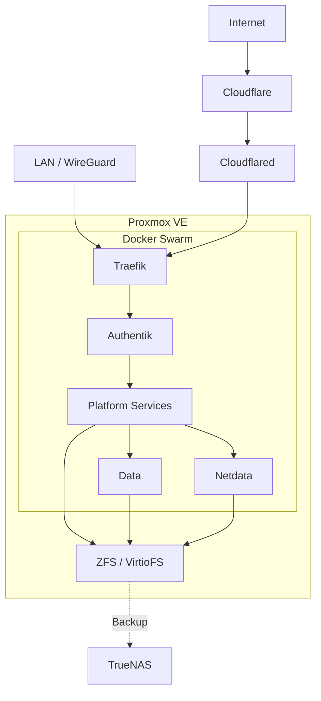

<div align="center">

# HX Lab

**A declarative, rebuildable self-hosted platform built on [Proxmox VE](https://www.proxmox.com/en/proxmox-virtual-environment/overview) and [Docker Swarm](https://docs.docker.com/engine/swarm/).**

[](...)
[](...)
[](LICENSE)

</div>

HX Lab manages my homelab infrastructure and application platform as code. Compute is reproducible, persistent state is independent from the Swarm lifecycle, and [Task](https://taskfile.dev/) provides the main operational interface.

---

## Table of Contents

- [Architecture](#architecture)
- [Design Principles](#design-principles)
- [Infrastructure](#infrastructure)
- [Platform](#platform)
- [Repository](#repository)
- [Operations](#operations)
- [Documentation](#documentation)
- [Security](#security)
- [Recovery](#recovery)
- [License](#license)

## Architecture



## Design Principles

| Principle              | What it means here                                                          |
| ---------------------- | --------------------------------------------------------------------------- |
| Infrastructure as Code | Infrastructure and configuration are versioned and reproducible.            |
| Separation of Concerns | Each tool owns a clear part of the system.                                  |
| Rebuildable Compute    | Hosts and services are recreated from code rather than maintained manually. |
| Independent State      | Persistent data survives Swarm and compute rebuilds.                        |
| Automated Operations   | Task provides repeatable deployment and recovery workflows.                 |

## Infrastructure

| Layer         | Technology                                                                    | Role                           |
| ------------- | ----------------------------------------------------------------------------- | ------------------------------ |
| Compute       | [Proxmox VE](https://www.proxmox.com/en/proxmox-virtual-environment/overview) | Hypervisor                     |
| Guest OS      | [Fedora CoreOS](https://fedoraproject.org/coreos/)                            | Swarm nodes                    |
| Provisioning  | [OpenTofu](https://opentofu.org/)                                             | Infrastructure resources       |
| Configuration | [Ansible](https://docs.ansible.com/)                                          | Proxmox configuration          |
| Network       | [OpenWrt](https://openwrt.org/)                                               | Routing, DHCP, firewall, VPN   |
| DNS           | [AdGuard Home](https://adguard.com/en/adguard-home/overview.html)             | Internal DNS                   |
| Storage       | [OpenZFS](https://openzfs.org/) + [VirtioFS](https://virtio-fs.gitlab.io/)    | Persistent application storage |
| Backup        | [TrueNAS](https://www.truenas.com/)                                           | Secondary backup storage       |

Network infrastructure is managed separately in [`hovirix/netlab`](https://github.com/Hovirix/netlab).

## Platform

| Layer          | Technology                                                                                             | Role                                   |
| -------------- | ------------------------------------------------------------------------------------------------------ | -------------------------------------- |
| Orchestration  | [Docker Swarm](https://docs.docker.com/engine/swarm/)                                                  | Runs platform services                 |
| Ingress        | [Traefik](https://traefik.io/traefik/)                                                                 | Routes application traffic             |
| Edge Connector | [Cloudflared](https://developers.cloudflare.com/cloudflare-one/networks/connectors/cloudflare-tunnel/) | Connects Cloudflare to Traefik         |
| Identity       | [Authentik](https://goauthentik.io/)                                                                   | Authentication and SSO                 |
| Data           | [PostgreSQL](https://www.postgresql.org/), [Valkey](https://valkey.io/)                                | Shared data services                   |
| Observability  | [Netdata](https://www.netdata.cloud/)                                                                  | Centralized host and container metrics |
| Applications   | [`platform/applications`](platform/applications)                                                       | Application stacks                     |

## Repository

```text
.
├── infrastructure/     # Provisioning and host configuration
├── platform/           # Docker Swarm stacks
├── operations/         # Task workflows and scripts
├── secrets/            # SOPS-encrypted secrets
├── security/           # Security tooling
├── .github/workflows/  # CI workflows
├── Taskfile.yml        # Operational interface
├── flake.nix           # Development environment
└── AGENTS.md           # Architecture and agent context
```

## Operations

[Task](https://taskfile.dev/) is the primary operational interface.

```bash
task             # List available commands
task check       # Validate the repository
task bootstrap   # Bootstrap the homelab
task deploy      # Deploy platform services
task status      # Show platform status
```

Provisioning, configuration, validation, secret delivery, Swarm initialization, deployment, and recovery are automated to keep normal operations and incident recovery fast and repeatable.

AI context and domain-specific agent skills provide queryable operational knowledge to diagnose incidents and guide the appropriate recovery workflows.

## Documentation

HX Lab intentionally keeps traditional written documentation and runbooks to a minimum.

Infrastructure, configuration, deployment, validation, and recovery workflows are declared as code and remain the source of truth. Architecture decisions, constraints, conventions, and procedures that cannot be expressed directly in code are maintained through `AGENTS.md`, AI context, and domain-specific agent skills.

```text
Code        → source of truth
Task        → operations and recovery
AGENTS.md   → architecture and project rules
AI skills   → queryable procedures and domain knowledge
```

## Security

- External exposure is default-deny.
- Public traffic enters through [Cloudflare](https://www.cloudflare.com/) and Traefik.
- Authentik provides application authentication and SSO.
- Secrets are encrypted with [SOPS](https://github.com/getsops/sops) and delivered through Docker Swarm secrets.
- Administrative access remains on trusted networks or VPN.

## Recovery

- Infrastructure and Swarm configuration are rebuildable from Git.
- Recovery workflows are automated through Task.
- Persistent application data is independent from the Swarm lifecycle.
- ZFS provides local snapshot capabilities.
- TrueNAS provides secondary backup storage.
- PostgreSQL requires database-aware backups in addition to infrastructure snapshots.

## License

Distributed under the [MIT License](LICENSE).
