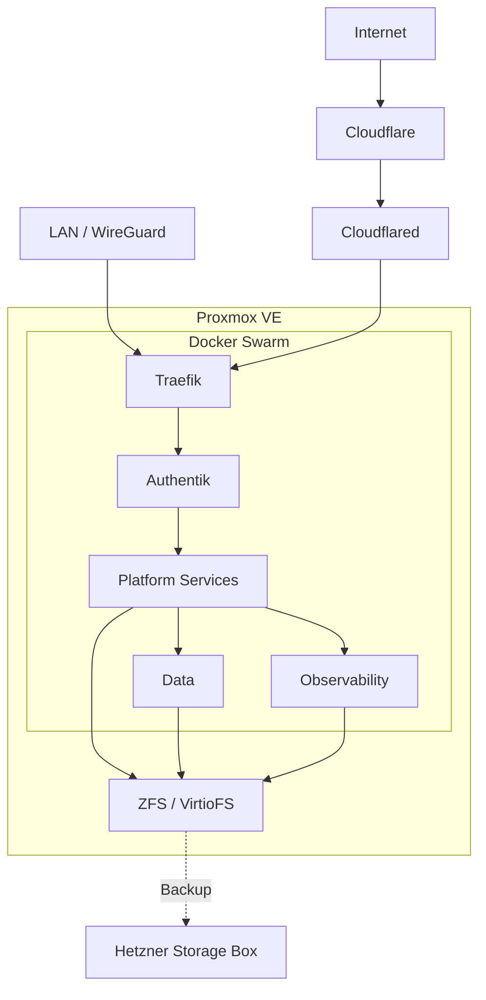

# HX Lab

**A declarative, rebuildable self-hosted platform built on [Proxmox VE](https://www.proxmox.com/en/proxmox-virtual-environment/overview) and [Docker Swarm](https://docs.docker.com/engine/swarm/).**

HX Lab manages my homelab infrastructure and application platform as code. Compute is reproducible, persistent state is independent from the Swarm lifecycle, and [Task](https://taskfile.dev/) provides the main operational interface.

## Architecture

```mermaid
flowchart TB
    internet[Internet] --> cloudflare[Cloudflare]
    cloudflare --> cloudflared[Cloudflared]
    lan[LAN / WireGuard] --> traefik[Traefik]
    cloudflared --> traefik

    subgraph proxmox[Proxmox VE]
        subgraph swarm[Docker Swarm]
            traefik --> authentik[Authentik]
            authentik --> services[Platform Services]

            services --> data[Data]
            services --> observability[Observability]
        end

        storage[ZFS / VirtioFS]
    end

    services --> storage
    data --> storage
    observability --> storage

    storage -. Backup .-> storagebox[Hetzner Storage Box]
```

## Design Principles

Configuration is versioned, compute is rebuildable, persistent state is independent, and Task provides repeatable operations.

## Infrastructure

| Layer         | Technology                                                                    | Role                           |
| ------------- | ----------------------------------------------------------------------------- | ------------------------------ |
| Compute       | [Proxmox VE](https://www.proxmox.com/en/proxmox-virtual-environment/overview) | Hypervisor                     |
| Guest OS      | [Fedora CoreOS](https://fedoraproject.org/coreos/)                            | Swarm nodes                    |
| Provisioning  | [OpenTofu](https://opentofu.org/)                                             | Infrastructure resources       |
| Configuration | [Ansible](https://docs.ansible.com/)                                          | Proxmox configuration          |
| Network       | [OpenWrt](https://openwrt.org/)                                               | Routing, DHCP, firewall, VPN   |
| DNS           | [AdGuard Home](https://adguard.com/en/adguard-home/overview.html)             | Internal DNS                   |
| Storage       | [OpenZFS](https://openzfs.org/) + [VirtioFS](https://virtio-fs.gitlab.io/)    | Persistent application storage |
| Backup        | [Borg](https://www.borgbackup.org/) + [borgmatic](https://torsion.org/borgmatic/) + [Hetzner Storage Box](https://www.hetzner.com/storage/storage-box/) | Off-site application backup |

Network infrastructure is managed separately in [`hovirix/netlab`](https://github.com/Hovirix/netlab).

## Platform

| Layer          | Technology                                                                                                                                                                               | Role                           |
| -------------- | ---------------------------------------------------------------------------------------------------------------------------------------------------------------------------------------- | ------------------------------ |
| Orchestration  | [Docker Swarm](https://docs.docker.com/engine/swarm/)                                                                                                                                    | Runs platform services         |
| Ingress        | [Traefik](https://traefik.io/traefik/)                                                                                                                                                   | Routes application traffic     |
| Edge Connector | [Cloudflared](https://developers.cloudflare.com/cloudflare-one/networks/connectors/cloudflare-tunnel/)                                                                                   | Connects Cloudflare to Traefik |
| Identity       | [Authentik](https://goauthentik.io/)                                                                                                                                                     | Authentication and SSO         |
| Data           | [PostgreSQL](https://www.postgresql.org/), [Valkey](https://valkey.io/)                                                                                                                  | Shared data services           |
| Observability  | [Grafana](https://grafana.com/), [VictoriaMetrics](https://victoriametrics.com/), [Loki](https://grafana.com/oss/loki/), [Alloy](https://grafana.com/oss/alloy-opentelemetry-collector/) | Metrics and logs               |
| Applications   | [`platform/applications`](platform/applications)                                                                                                                                         | Application stacks             |

## Repository

See [`AGENTS.md`](AGENTS.md) for the repository map and operational boundaries.

## Operations

Run `task --list` to see the operational workflows.

## Documentation

Executable configuration is the source of truth; `AGENTS.md` and `.opencode/skills/` cover project rules and procedures.

## Security

- External exposure is default-deny.
- Public traffic enters through [Cloudflare](https://www.cloudflare.com/) and Traefik.
- Authentik provides application authentication and SSO.
- [SecretSpec](https://secretspec.dev) declares secrets, with [SOPS](https://github.com/getsops/sops) as encrypted storage and Docker Swarm secrets for delivery.
- Administrative access remains on trusted networks or VPN.

## Recovery

- Infrastructure and Swarm configuration are rebuildable from Git.
- Recovery workflows are automated through Task.
- Persistent application data is independent from the Swarm lifecycle.
- ZFS provides hourly local recovery points for all Swarm datasets.
- Borgmatic takes temporary ZFS snapshots of Paperless, PostgreSQL, and Vaultwarden and backs them up to Hetzner Storage Box with Borg.
- PostgreSQL logical backups, WAL archiving, and PITR remain separate future work.

## License

Distributed under the [MIT License](LICENSE).
