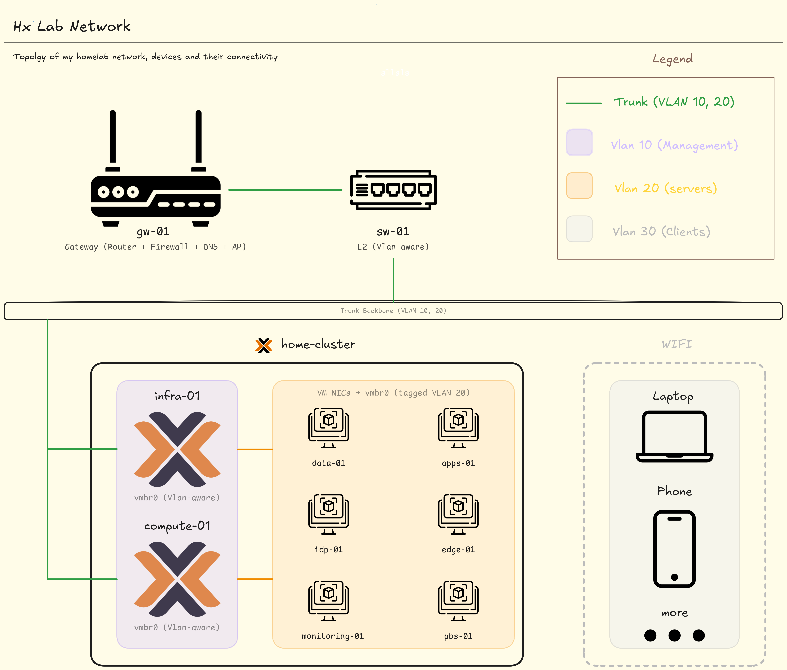

---

## Network Topology (Layers 1–2)

---

## Continue reading

<Columns cols={3}>
  <Card
    title="Network Layer"
    href="/architecture/01-networking/02-network-layer"
    icon="globe"
  >
    Subnets, routing, gateways, firewall
  </Card>

  <Card
    title="Transport Layer"
    href="/architecture/01-networking/03-transport-layer"
    icon="arrow-right-arrow-left"
  >
    Ports, TCP/UDP, NAT, port forwarding
  </Card>

  <Card
    title="Applications"
    href="/architecture/01-networking/04-application-and-services"
    icon="server"
  >
    DNS, reverse proxy, services, auth
  </Card>
</Columns>

---
