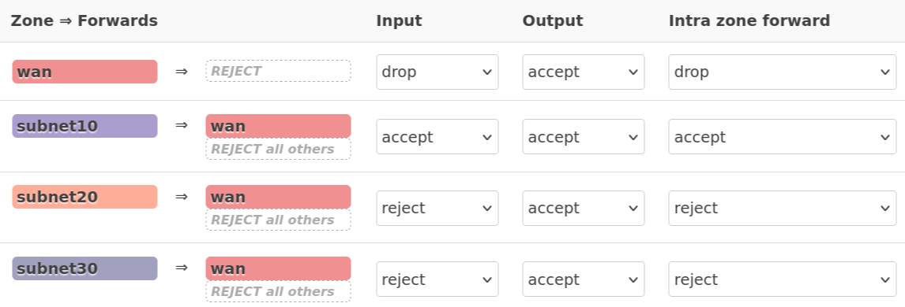

## IP addressing scheme

The network uses a deterministic IP addressing scheme. Each VLAN follows the same allocation model so that a host's role can be inferred from its address.

### Allocation model

| Range        | Purpose                      |
| ------------ | ---------------------------- |
| `.1`         | Gateway                      |
| `.2 - .9`    | Reserved                     |
| `.10 - .49`  | Infrastructure               |
| `.50 - .99`  | Platform services            |
| `.100 - .199`| Applications / VMs           |
| `.200 - .254`| Clients / DHCP / temporary   |

### VLAN addressing

<Tabs>
  <Tab title="VLAN 10 — Management">

  Used for infrastructure and administrative access.

  **Typical usage**
  - `.10–49` → Proxmox nodes, OpenWRT management, core infrastructure
  - `.50–99` → Monitoring and admin tooling
  - No client devices

  </Tab>

  <Tab title="VLAN 20 — Servers">

  Used for applications and platform services.

  **Typical usage**
  - `.10–49` → Reverse proxy, identity provider, core services
  - `.50–99` → Databases and observability
  - `.100–199` → Application VMs

  </Tab>

  <Tab title="VLAN 30 — Clients">

  Used for user devices and WiFi clients.

  **Typical usage**
  - `.10–49` → Reserved or static clients
  - `.50–199` → DHCP pool
  - `.200–254` → Temporary or overflow

  </Tab>
</Tabs>

---

## Routing

### Default gateways

OpenWRT is the default gateway for all VLANs.

| VLAN | Subnet         | Gateway     |
| ---- | -------------- | ----------- |
| 10   | `10.10.0.0/24` | `10.10.0.1` |
| 20   | `10.20.0.0/24` | `10.20.0.1` |
| 30   | `10.30.0.0/24` | `10.30.0.1` |

### Behavior

- Same VLAN → switched locally
- Different VLAN → routed through OpenWRT
- Internet-bound traffic → OpenWRT → WAN

---

## Firewall

### Default posture

- Inter-VLAN → deny
- WAN inbound → deny
- WAN outbound → allow with NAT

### Zone model

### Allowed flows

| Source   | Destination | Ports      | Action |
| -------- | ----------- | ---------- | ------ |
| VLAN 10  | VLAN 20     | `22`       | Allow  |
| VLAN 30  | VLAN 20     | `80`, `443`| Allow  |
| VLAN 30  | VLAN 10     | Any        | Deny   |
| VLAN 20  | VLAN 10     | Any        | Deny   |
| All VLANs| WAN         | Required   | Allow  |

---
